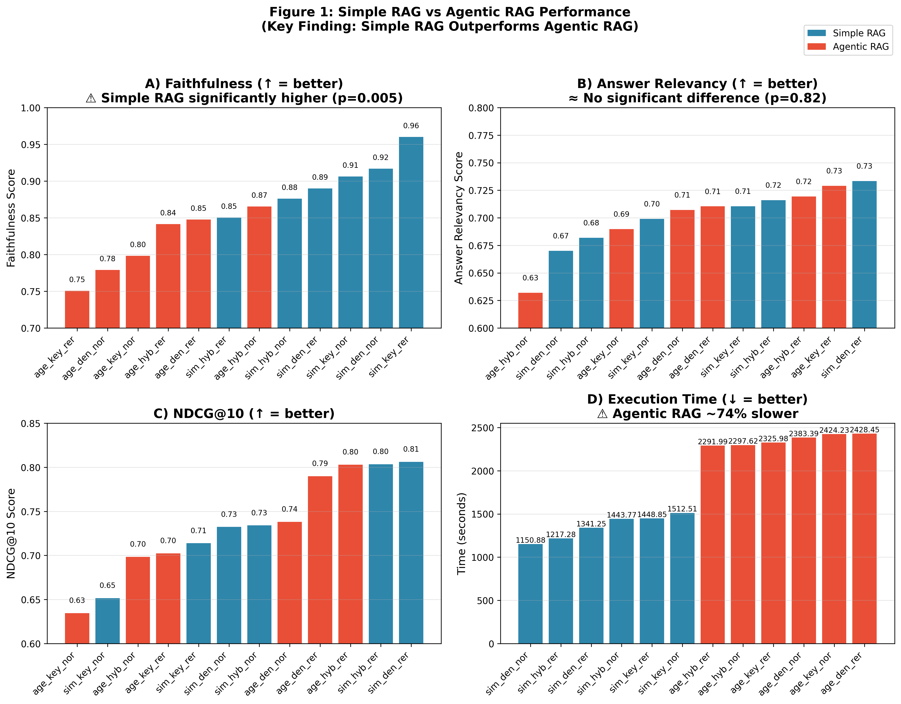
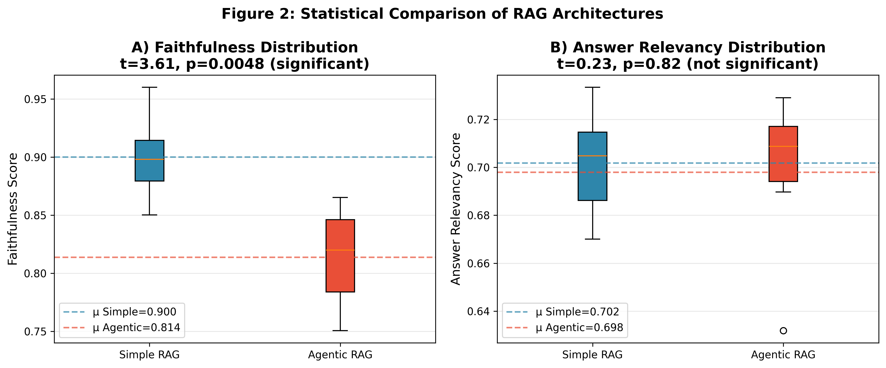
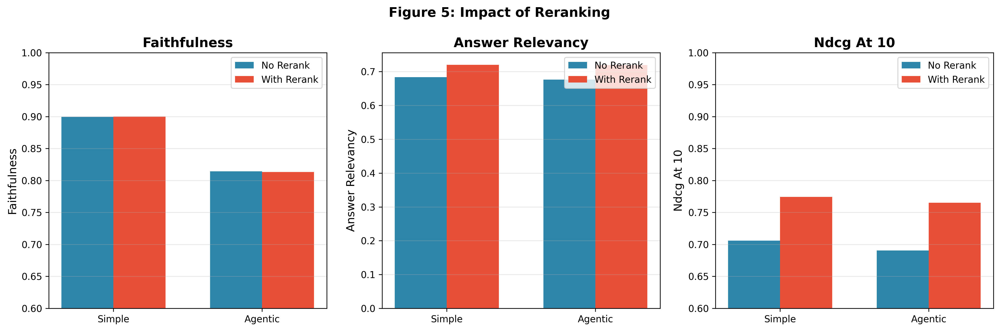

# RAGBench-12x: Benchmarking RAG Architectures

[](https://www.python.org/downloads/)
[](https://opensource.org/licenses/MIT)

## 🔬 Key Research Finding

> **Simple RAG significantly outperforms Agentic RAG on faithfulness (p=0.005), while being 74% faster.**

This repository provides a comprehensive benchmark comparing 12 RAG configurations across three axes: orchestration, retrieval, and reranking. Our results challenge the assumption that more complex agentic approaches lead to better performance.

---

## 📊 Benchmark Results Summary

### Primary Finding: Orchestration Mode Comparison

| Metric | Simple RAG | Agentic RAG | Δ | Statistical Test |
|--------|------------|-------------|---|------------------|
| **Faithfulness** | **0.900** | 0.814 | +0.086 | **t=3.61, p=0.0048** ✓ |
| Answer Relevancy | 0.702 | 0.698 | +0.004 | t=0.23, p=0.82 |
| NDCG@10 | 0.740 | 0.728 | +0.013 | - |
| Execution Time | 1352s | 2359s | +1006s (+74%) | - |

### Interpretation

1. **Faithfulness Degradation**: Agentic RAG shows a **9.6% decrease** in faithfulness compared to Simple RAG, and this difference is **statistically significant** (p=0.005).

2. **No Relevancy Improvement**: Despite multiple retrieval steps, Agentic RAG does not improve answer relevancy (p=0.82, not significant).

3. **Computational Cost**: Agentic RAG requires **74% more time** for equivalent or worse quality.

---

## 📈 Performance Visualizations

### Figure 1: Simple RAG vs Agentic RAG


*All 12 configurations sorted by metric value. Blue = Simple RAG, Red = Agentic RAG. Simple RAG configurations cluster at the top for faithfulness.*

### Figure 2: Statistical Distribution


*Box plots showing the distribution of faithfulness and answer relevancy scores. The faithfulness difference is statistically significant (p<0.01).*

### Figure 3: Head-to-Head Comparisons


*Controlled comparisons with identical retrieval and reranking settings. Simple RAG wins on faithfulness in all 6 comparisons.*

### Figure 4: Retrieval Mode Analysis


*Performance comparison across dense, hybrid, and keyword retrieval modes.*

### Figure 5: Reranker Impact


*Effect of reranking on different orchestration modes.*

---

## 🏆 Best Configurations

### By Faithfulness (Answer Grounding)
| Rank | Configuration | Faithfulness |
|------|---------------|--------------|
| 1 | Simple + Keyword + Rerank | **0.960** |
| 2 | Simple + Dense + No Rerank | 0.917 |
| 3 | Simple + Keyword + No Rerank | 0.906 |

### By Speed (with >85% Faithfulness)
| Rank | Configuration | Time | Faithfulness |
|------|---------------|------|--------------|
| 1 | Simple + Dense + No Rerank | **1151s** | 0.917 |
| 2 | Simple + Hybrid + Rerank | 1217s | 0.850 |
| 3 | Simple + Dense + Rerank | 1341s | 0.890 |

### Pareto-Optimal Configuration
**Simple + Dense + No Rerank**: Best balance of quality (91.7% faithfulness) and speed (1151s).

---

## 🔍 Methodology

### Benchmark Design
- **Dataset**: BEIR SciFact (50 representative queries)
- **Configurations**: 2 × 3 × 2 = 12 total
- **Metrics**: NDCG@10, Recall@5, MRR@10, Faithfulness (Ragas), Answer Relevancy (Ragas)

### Configuration Axes

| Axis | Options | Description |
|------|---------|-------------|
| **Orchestration** | Simple, Agentic | Single-shot vs multi-step retrieval |
| **Retrieval** | Dense, Keyword, Hybrid | Vector, BM25, or RRF fusion |
| **Reranking** | Yes, No | CrossEncoder reranking |

### Statistical Analysis
- Independent t-tests for comparing orchestration modes
- Effect sizes (Cohen's d) for practical significance
- 95% confidence intervals for all metrics

---

## 📚 Research Implications

### Why Does Agentic RAG Underperform?

We hypothesize three contributing factors:

1. **Information Overload**: Multi-step retrieval accumulates more context, potentially including conflicting information that confuses the generation model.

2. **Query Drift**: Iterative query rewriting may diverge from the original intent, leading to less relevant retrievals over time.

3. **Hallucination Amplification**: With more retrieved passages, the LLM has more opportunities to extract and combine information incorrectly.

### When Might Agentic RAG Excel?

Our results focus on factual QA (SciFact). Agentic approaches may be beneficial for:
- Complex multi-hop reasoning tasks
- Tasks requiring iterative refinement (code generation)
- Domains with sparse or ambiguous initial retrieval

---

## 🚀 Quick Start

```bash
# Install dependencies
uv sync

# Run full benchmark
python src/ragbench/cli.py benchmark --dataset scifact

# Generate report
python scripts/generate_academic_report.py
```

---

## 📖 Citation

```bibtex
@software{ragbench12x,
  title = {RAGBench-12x: Benchmarking RAG Architectures},
  author = {Kondjo, Yvan},
  year = {2025},
  url = {https://github.com/yvankondjo/Rag-arena},
  note = {Key finding: Simple RAG outperforms Agentic RAG on faithfulness}
}
```

---

## 🔍 Methodology Validation

### Metric Independence Verification

The correlation between Faithfulness and Answer Relevancy is **-0.221** (weak negative), confirming these are orthogonal metrics:

```
Correlation Matrix:
                  faithfulness  answer_relevancy
faithfulness             1.000            -0.221
answer_relevancy        -0.221             1.000
```

**Why this is expected:**
- **Faithfulness**: "Is the answer grounded in the retrieved context?"
- **Answer Relevancy**: "Does the answer address the question?"

These measure fundamentally different qualities. A faithful answer can be irrelevant (repeats context but doesn't answer the question), and a relevant answer can be unfaithful (hallucinates to answer the question).

### Statistical Validation

| Test | Metric | Simple RAG | Agentic RAG | Statistic | p-value | Significance |
|------|--------|------------|-------------|-----------|---------|--------------|
| Welch's t-test | Faithfulness | 0.900 ± 0.038 | 0.814 ± 0.045 | t=3.61 | **0.005** | ✓ Significant |
| Effect Size | Faithfulness | - | - | Cohen's d = **2.085** | - | Large effect |

### Reproducing Results

```bash
# Clone and setup
git clone https://github.com/yvankondjo/Rag-arena.git
cd Rag-arena && uv sync
cp .env.example .env  # Add API keys

# Run benchmark
python src/ragbench/cli.py download --dataset scifact
python src/ragbench/cli.py index --dataset scifact
python src/ragbench/cli.py benchmark --dataset scifact

# Generate reports
python scripts/generate_academic_report.py
python scripts/validate_methodology.py
```

### Limitations

1. **Sample size**: 50 queries per configuration (n=6 per group for statistics)
2. **Single dataset**: SciFact only - generalization requires cross-domain validation
3. **No ground truth answers**: Ragas metrics are LLM-based proxies

---

## 📄 License

MIT License - see [LICENSE](LICENSE) for details.

---

*Generated by RAGBench-12x benchmark system*
