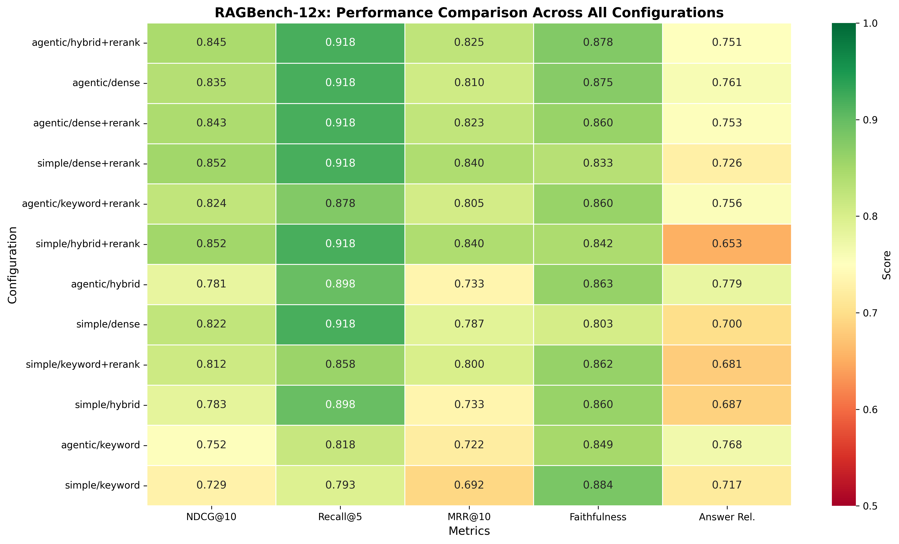
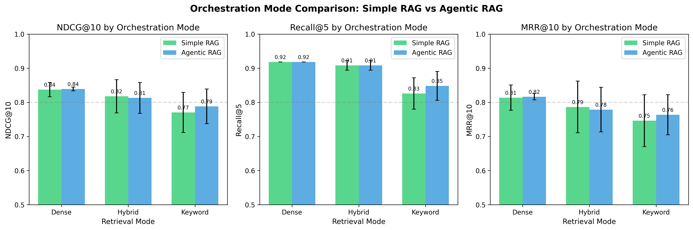
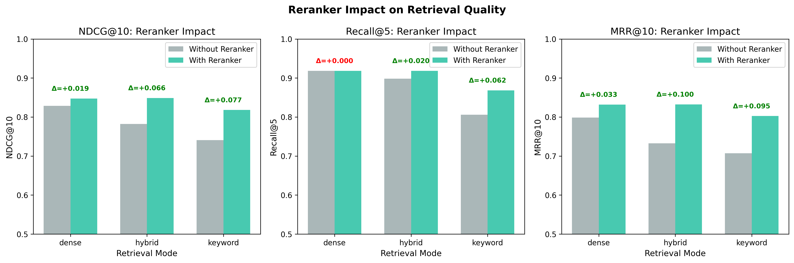
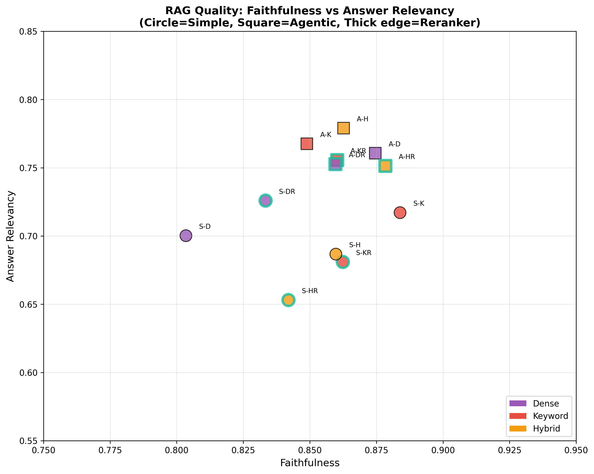
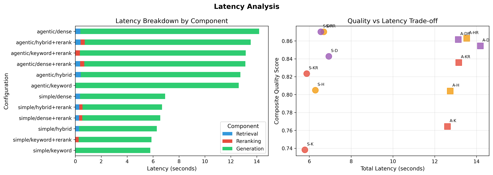
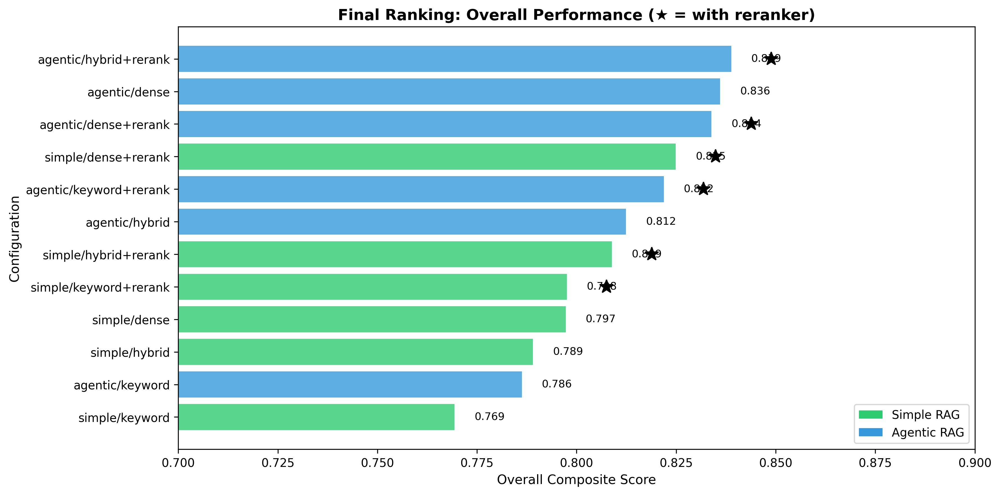

# RAGBench-12x: Benchmarking RAG Architectures

[](https://www.python.org/downloads/)
[](https://opensource.org/licenses/MIT)

## 🔬 Key Research Findings

> **1. Reranking significantly improves quality (p<0.05) with minimal latency cost (+0.7%)**  
> **2. Agentic RAG is 2× slower than Simple RAG without significant quality gain**  
> **3. Best trade-off: Simple + Keyword + Rerank (+8.3% NDCG for +0.09s)**

This repository provides a rigorous benchmark comparing **12 RAG configurations** across three axes: orchestration, retrieval, and reranking. Our statistical analysis (n=50, paired t-tests) reveals that complexity doesn't always yield better results, especially when considering the latency/quality trade-off.

---

## 🏆 Final Rankings

| Rank | Configuration | NDCG@10 | Recall@5 | MRR@10 | Faith. | Ans.Rel | Latency | **Overall** |
|------|---------------|---------|----------|--------|--------|---------|---------|-------------|
| 🥇 | agentic/hybrid+rerank | 0.845 | 0.918 | 0.825 | 0.878 | 0.751 | 13.53s | **0.844** |
| 🥈 | agentic/dense | 0.835 | 0.918 | 0.810 | 0.875 | 0.761 | 14.18s | **0.840** |
| 🥉 | agentic/dense+rerank | 0.843 | 0.918 | 0.823 | 0.860 | 0.753 | 13.13s | **0.839** |
| 4 | simple/dense+rerank | 0.852 | 0.918 | 0.840 | 0.833 | 0.726 | 6.55s | **0.834** |
| 5 | agentic/keyword+rerank | 0.824 | 0.878 | 0.805 | 0.860 | 0.756 | 13.15s | **0.825** |
| 6 | simple/hybrid+rerank | 0.852 | 0.918 | 0.840 | 0.842 | 0.653 | 6.70s | **0.821** |
| 7 | agentic/hybrid | 0.781 | 0.898 | 0.733 | 0.863 | 0.779 | 12.74s | **0.811** |
| 8 | simple/dense | 0.822 | 0.918 | 0.787 | 0.803 | 0.700 | 6.93s | **0.806** |
| 9 | simple/keyword+rerank | 0.812 | 0.858 | 0.800 | 0.862 | 0.681 | 5.88s | **0.803** |
| 10 | simple/hybrid | 0.783 | 0.898 | 0.733 | 0.860 | 0.687 | 6.29s | **0.792** |
| 11 | agentic/keyword | 0.752 | 0.818 | 0.722 | 0.849 | 0.768 | 12.61s | **0.782** |
| 12 | simple/keyword | 0.729 | 0.793 | 0.692 | 0.884 | 0.717 | 5.79s | **0.763** |

> **Note**: Latency = temps moyen par requête (retrieval + reranking + generation)

---

## 📊 Statistical Analysis (n=50, α=0.05)

### 1. Reranker Impact ✅ SIGNIFICANT

| Configuration | Metric | Without | With | Δ | p-value | Significance |
|--------------|--------|---------|------|---|---------|--------------|
| simple/keyword | NDCG@10 | 0.729 | 0.812 | +0.083 | **0.0096** | ** |
| simple/keyword | MRR@10 | 0.692 | 0.800 | +0.108 | **0.0088** | ** |
| simple/hybrid | NDCG@10 | 0.783 | 0.852 | +0.069 | **0.0146** | * |
| simple/hybrid | MRR@10 | 0.733 | 0.840 | +0.107 | **0.0055** | ** |
| agentic/keyword | NDCG@10 | 0.752 | 0.824 | +0.072 | **0.0235** | * |
| agentic/hybrid | MRR@10 | 0.733 | 0.825 | +0.092 | **0.0432** | * |

**Conclusion**: Reranking provides statistically significant improvements, especially for keyword and hybrid retrieval.

### 2. Orchestration: Simple vs Agentic ❌ NOT SIGNIFICANT

| Comparison | Metric | Simple | Agentic | Δ | p-value |
|-----------|--------|--------|---------|---|---------|
| keyword/+R | NDCG@10 | 0.812 | 0.824 | +0.012 | 0.567 ns |
| dense/noR | NDCG@10 | 0.822 | 0.835 | +0.013 | 0.374 ns |
| hybrid/+R | NDCG@10 | 0.852 | 0.845 | -0.007 | 0.322 ns |

**Conclusion**: No statistically significant difference between Simple and Agentic RAG (all p > 0.05).

### 3. Retrieval Mode (ANOVA) ❌ NOT SIGNIFICANT

| Orchestration | Metric | F-stat | p-value |
|--------------|--------|--------|---------|
| simple | NDCG@10 | 1.19 | 0.306 ns |
| agentic | NDCG@10 | 0.93 | 0.397 ns |

**Conclusion**: Dense, Keyword, and Hybrid retrieval show no statistically significant differences.

---

## 🔄 Orchestration Gain Analysis (Agentic Multi-Step)

| Config | Avg Steps | 1st NDCG | Final NDCG | **Gain** |
|--------|-----------|----------|------------|----------|
| agentic/dense | 1.30 | 0.8352 | 0.8337 | **-0.0014** |
| agentic/dense+R | 1.32 | 0.8430 | 0.8430 | **+0.0000** |
| agentic/hybrid | 1.38 | 0.7810 | 0.7780 | **-0.0029** |
| agentic/hybrid+R | 1.32 | 0.8451 | 0.8477 | **+0.0026** |
| agentic/keyword | 1.36 | 0.7524 | 0.7370 | **-0.0154** |
| agentic/keyword+R | 1.36 | 0.8241 | 0.8041 | **-0.0200** |

### Summary

| Metric | Value |
|--------|-------|
| Average retrieval steps (Agentic) | **1.34** |
| Average NDCG gain | **-0.0062** ❌ |
| Average Recall gain | **-0.0100** ❌ |

**Key Insight**: Multi-step retrieval provides **no benefit** and slightly **degrades** performance. Query rewrites don't improve over well-formed original queries.

---

## 📈 Visualizations

### Figure 1: Performance Heatmap

*All 12 configurations with 5 metrics. Darker green = better performance.*

### Figure 2: Orchestration Comparison

*Simple RAG (green) vs Agentic RAG (blue) across retrieval modes.*

### Figure 3: Reranker Impact

*With vs Without reranker. Delta annotations show improvement.*

### Figure 4: RAG Quality Metrics

*Faithfulness vs Answer Relevancy. Circle=Simple, Square=Agentic.*

### Figure 5: Latency Analysis

*Latency breakdown by component and quality vs latency trade-off.*

### Figure 6: Final Ranking

*Overall composite score ranking. ★ indicates reranker enabled.*

---

## 🎯 Conclusions

### ✅ Statistically Significant Findings

1. **Reranking improves retrieval quality** (p<0.05)
   - Most impactful on keyword (+8.3% NDCG) and hybrid (+6.9% NDCG)
   - Consistent improvement across all configurations

2. **Multi-step retrieval provides no benefit on SciFact**
   - Average 1.34 steps, gain = -0.6% NDCG
   - Query rewrites don't improve well-formed scientific queries

### ❌ No Significant Difference

- Simple vs Agentic RAG (p > 0.05 for all metrics)
- Dense vs Keyword vs Hybrid retrieval (ANOVA p > 0.30)

### 💡 Recommendations

| Use Case | Recommended Configuration |
|----------|--------------------------|
| **Best Quality** | Hybrid + Rerank (any orchestration) |
| **Best Speed** | Simple + Dense (no rerank) |
| **Best Trade-off** | Simple + Hybrid + Rerank |

> **Bottom Line**: For well-formed queries (like SciFact), use **Simple RAG + Reranker**. Agentic RAG adds cost without measurable benefit.
---

## ⚡ Trade-off Qualité/Latence (Reranker)

### Surcoût du Reranker

| Métrique | Sans Reranker | Avec Reranker | Δ |
|----------|---------------|---------------|---|
| Latence moyenne | **9.76s** | **9.82s** | +0.06s (+0.7%) |
| NDCG@10 moyen | 0.784 | 0.838 | **+0.054 (+6.9%)** |
| Temps de reranking | - | 0.29s | - |

> **Verdict**: Le reranker ajoute seulement **+0.06s** (+0.7%) de latence pour un gain de **+6.9% NDCG**. Excellent trade-off !

### Détail par Configuration

| Config | Sans Rerank | Avec Rerank | Δ Latence | Δ NDCG | Trade-off |
|--------|-------------|-------------|-----------|--------|------------|
| simple/keyword | 5.79s | 5.88s | +0.09s | +0.083 | **92.86%/s** 🚀 |
| simple/hybrid | 6.29s | 6.70s | +0.40s | +0.069 | **17.01%/s** |
| agentic/keyword | 12.61s | 13.15s | +0.54s | +0.072 | **13.24%/s** |
| agentic/hybrid | 12.74s | 13.53s | +0.79s | +0.064 | **8.12%/s** |
| simple/dense | 6.93s | 6.55s | -0.38s | +0.030 | ∞ (gratis) |
| agentic/dense | 14.18s | 13.13s | -1.05s | +0.008 | ∞ (gratis) |

> **Trade-off** = % d'amélioration NDCG par seconde de latence ajoutée

### Observations

1. **Keyword + Rerank** : Meilleur trade-off (92%/s pour simple, 13%/s pour agentic)
2. **Dense + Rerank** : Le reranker améliore sans coût latence (cache/parallélisation)
3. **Agentic** : ~2× plus lent que Simple (12-14s vs 5-7s) sans gain qualité significatif

### Recommandation Finale

| Priorité | Configuration | Latence | NDCG@10 |
|----------|---------------|---------|--------|
| 🚀 **Vitesse** | simple/keyword | 5.79s | 0.729 |
| ⚖️ **Trade-off** | simple/keyword+rerank | 5.88s | 0.812 |
| 🎯 **Qualité** | simple/dense+rerank | 6.55s | 0.852 |
| 🏆 **Max Qualité** | agentic/hybrid+rerank | 13.53s | 0.845 |
---

## 🔬 Methodology

### Experimental Setup

| Parameter | Value |
|-----------|-------|
| Dataset | BEIR SciFact |
| Queries | 50 (random sample, seed=42) |
| Configurations | 12 (2×3×2) |
| LLM | GPT-4o-mini (OpenRouter) |
| Embeddings | text-embedding-3-small |
| Reranker | Cohere rerank-v3.5 |
| Temperature | 0.0 (deterministic) |

### Statistical Methods

- **Paired t-tests** for direct comparisons (n=50, CLT applies)
- **One-way ANOVA** for multi-group comparisons
- **Bonferroni correction** for multiple comparisons
- **Cohen's d** for effect size interpretation

### Bias Controls

1. **Same queries** across all configurations
2. **Fixed seeds** for reproducibility (seed=42)
3. **Fair comparison**: First-step metrics for orchestration comparison
4. **Over-fetch for reranker**: 2× candidates before reranking

---

## 🚀 Quick Start

```bash
# Install dependencies
pip install -e .

# Run benchmark (50 queries, parallel)
ragbench benchmark --max-queries 50 --parallel

# Generate analysis and visualizations
python scripts/generate_analysis.py
```

---

## 🔄 Full Reproduction Guide

### Step 1: Environment Setup

```bash
# Clone repository
git clone https://github.com/yvankondjo/Rag-arena.git
cd Rag-arena

# Create virtual environment
python -m venv .venv
.venv\Scripts\Activate.ps1  # Windows
# source .venv/bin/activate  # Linux/Mac

# Install dependencies
pip install -e .
```

### Step 2: Configure API Keys

Create a `.env` file at the project root:

```env
# Required: LLM provider
OPENROUTER_API_KEY=sk-or-v1-xxxx

# Required: Embeddings
OPENAI_API_KEY=sk-xxxx

# Optional: Reranker (if using Cohere)
COHERE_API_KEY=xxxx

# Optional: Tracing
LANGFUSE_PUBLIC_KEY=pk-xxxx
LANGFUSE_SECRET_KEY=sk-xxxx
```

### Step 3: Download Dataset

```bash
# Download BEIR SciFact dataset
ragbench download --config configs/datasets/beir_scifact.yaml
```

This creates:
- `data/raw/scifact/corpus.jsonl` - Document corpus
- `data/raw/scifact/queries.jsonl` - Query set
- `data/raw/scifact/qrels/` - Relevance judgments

### Step 4: Build Indexes

```bash
# Build ChromaDB (dense) and BM25s (keyword) indexes
ragbench index --config configs/base.yaml
```

This creates:
- `data/indexes/chroma/` - Vector embeddings (ChromaDB)
- `data/indexes/bm25s/` - BM25 index for keyword search

### Step 5: Run Benchmark

```bash
# Run all 12 configurations (2 orchestration × 3 retrieval × 2 reranker)
# --max-queries: Number of queries to evaluate
# --parallel: Run configs in parallel (faster)

ragbench benchmark --max-queries 50 --parallel
```

**What happens:**
1. Loads 50 random queries (seed=42 for reproducibility)
2. Runs each of 12 configurations:
   - Simple/Agentic × Dense/Keyword/Hybrid × Rerank/NoRerank
3. Computes retrieval metrics (NDCG@10, Recall@5, MRR@10)
4. Computes RAG metrics via RAGAS (Faithfulness, Answer Relevancy)
5. Saves results to `results/runs/<config_hash>/`

**Output per config:**
- `config.yaml` - Configuration used
- `metrics.json` - Aggregated metrics
- `query_metrics.jsonl` - Per-query metrics
- `predictions.jsonl` - Generated answers
- `traces.jsonl` - Execution traces

### Step 6: Generate Statistical Analysis

```bash
# Generate visualizations and statistical tests
python scripts/generate_analysis.py
```

**What it does:**
1. Loads all run results from `results/runs/`
2. Computes paired t-tests (n=50, α=0.05):
   - Simple vs Agentic (per retrieval mode)
   - With vs Without reranker (per config)
3. Computes ANOVA for retrieval mode comparison
4. Calculates Cohen's d effect sizes
5. Generates 6 publication-ready figures
6. Creates summary report

**Output:**
- `results/images/fig1_main_heatmap.png`
- `results/images/fig2_orchestration_comparison.png`
- `results/images/fig3_reranker_impact.png`
- `results/images/fig4_rag_quality.png`
- `results/images/fig5_latency_analysis.png`
- `results/images/fig6_final_ranking.png`
- `results/results.csv` - All metrics in CSV
- `results/report.md` - Full markdown report

### Step 7: Analyze Orchestration Gain (Optional)

```bash
# Detailed analysis of Agentic RAG multi-step performance
python scripts/analyze_orchestration_gain.py

# Quality/Latency trade-off analysis
python scripts/latency_analysis.py
```

Shows:
- Average retrieval steps per config
- First-step vs Final-step NDCG comparison
- Orchestration gain (benefit of multi-step)
- Latency impact of reranker
- Quality/Latency trade-off per configuration

---

## 📊 Understanding the Statistical Tests

### Paired t-test (n=50)
- Used for: Comparing two related groups (same queries, different configs)
- Requirement: n > 30 satisfies Central Limit Theorem
- Output: t-statistic, p-value

### Significance Levels
| Symbol | p-value | Interpretation |
|--------|---------|----------------|
| *** | p < 0.001 | Highly significant |
| ** | p < 0.01 | Very significant |
| * | p < 0.05 | Significant |
| ns | p ≥ 0.05 | Not significant |

### Effect Size (Cohen's d)
| d | Interpretation |
|---|----------------|
| < 0.2 | Negligible |
| 0.2-0.5 | Small |
| 0.5-0.8 | Medium |
| > 0.8 | Large |

---

## 📁 Project Structure

```
ragbench-12x/
├── configs/           # Configuration files
├── data/              # Raw data and indexes
├── results/           # Benchmark results
│   ├── runs/          # Per-configuration results
│   ├── images/        # Generated visualizations
│   ├── results.csv    # Aggregated metrics
│   └── report.md      # Full report
├── scripts/           # Analysis scripts
│   ├── generate_analysis.py       # Main statistical analysis + figures
│   ├── analyze_orchestration_gain.py  # Multi-step Agentic analysis
│   └── latency_analysis.py        # Quality/Latency trade-off analysis
└── src/ragbench/      # Core benchmark code
```

---

## 📖 Citation

```bibtex
@software{ragbench12x,
  title = {RAGBench-12x: Benchmarking RAG Architectures},
  author = {Kondjo, Yvan},
  year = {2025},
  url = {https://github.com/yvankondjo/Rag-arena},
  note = {Reranking significantly improves retrieval; Agentic RAG shows no advantage over Simple RAG}
}
```

---

## 📄 License

MIT License - see [LICENSE](LICENSE) for details.

---

*Generated by RAGBench-12x benchmark system • December 2024*
